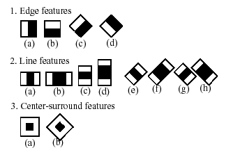

# Relazione Progetto di Social Media Management

**Nome**: *Luca Venerando*

**Cognome**: *Greco*

**Matricola**: *1000016165*

**Corso**: Social Media Management

**Docente**: Antonino Furnari

**Anno Accademico**: *2022/2023*

## Indice 

* [Introduzione](#introduzione)
* [Obiettivi](#obiettivi)
* [Strategia Generale](#strategia-generale)
* [Metodologia e Algoritmi](#metodologia-e-algoritmi)
    * [Face Detection](#face-detection)
    * [Backprojection](#backprojection)
    * [Mean-Cam Shift](#mean-cam-shift)
* [Risultati](#risultati)
* [Conclusioni](#conclusioni)

## Introduzione

Center stage è una feature introdotta da Apple nel 2021 e attualmente disponibile solo ad un ristretta gamma di [prodotti](https://support.apple.com/en-us/HT212315). Questa speciale funzionalità permette di simulare una fotocamera mobile andando ad adattare dinamicamente l'inquadratura in base alla posizione del soggetto; il tutto sostenuto dal coprocessore neurale presente in tutti i dispositivi Apple compatibili.

## Obiettivi

L'obiettivo principale del progetto è quello di creare un'applicazione che permetta di approssimare la funzione di Center Stage in maniera indipendente e gratuita senza richiedere hardware specializzato. 

## Strategia Generale

L'idea principale di questo progetto è quello sfruttare il pre-esistente algoritmo [Mean/Cam-Shift](https://docs.opencv.org/5.x/d7/d00/tutorial_meanshift.html) per il tracciamento di oggetti colorati attraverso il calcolo della maschera di backprojection in un frame. Tuttavia questo algoritmo necessita di un istogramma rappresentativo dell'oggetto da tracciare per poter funzionare.

Per ovviare al problema allora si è pensato di utilizzare un modello pre-addestrato per la rilevazione di volti, in particolare il modello [haarcascade_frontalface](https://docs.opencv.org/5.x/db/d28/tutorial_cascade_classifier.html) presente anch'esso all'interno dello stack di OpenCV.

N.B: l'utilizzo esclusivo di un face detector risulterebbe poco efficace nello specifico obiettivo affrontato, in quanto la scarsa capacità del modello a generalizzare prospettive diverse del volto renderebbe poco preciso il rilevamento, e inoltre, la pesantezza computazione del modello renderebbe l'applicazione poco reattiva, per questo si è deciso di combinare insieme i due approcci.

## Metodologia e Algoritmi 

### Face Detection

Per la rilevazione dei volti si è deciso di utilizzare il modello [haarcascade_frontal](https://docs.opencv.org/5.x/db/d28/tutorial_cascade_classifier.html), sviluppato nel 2001 da Paul Viola e Michael Jones, questo modello estrapola le Haar feature e le sfrutta con un cascade classifier per determinare la presenza di un volto in un frame.

Le Haar feature sono un insieme di rettangoli che suddividendo una piccola area del frame tentano di estrapolarne delle feature che permettano di capire se una determinata regione dell'immagine presenta o meno una certa caratteristica, nel nostro caso qualcosa che suggerisca la presenza di un volto.

Un insieme di classificatori, ciascuno con un suo insieme di feature viene addestrato, e successivamente, combinato in un cascade classifier. In esso svariati classificatori "weak" voteranno per la presenza o meno di un volto, in questo modo si ottiene un classificatore "strong" che è in grado di rilevare la presenza di un volto in un frame.

Questo approccio permette di ridurre il numero di calcoli necessari per la classificazione di un frame, in quanto se un classificatore non rileva la presenza di un volto allora il frame viene scartato e non viene sottoposto ad ulteriori analisi.

Opencv mette a disposizione un modello gia trainato per la rilevazione di volti e delle API python per fare inferenza su un frame. 

Grazie ad esso riusciamo ad ottenere un bounding box approssimativo del volto, che ci permette di estrapolare un istogramma rappresentativo del soggetto che poi andremo a tracciare usando l'algoritmo Mean/Cam-Shift.

### Backprojection

La backprojection è un metodo per la segmentazione di un oggetto in un frame attraverso il match degli istogrammi, in particolare, esso permette di estrapolare una maschera di probabilità che rappresenta la probabilità che un pixel appartenga all'oggetto da tracciare.

Gli step principali per la backprojection sono:

1. Calcolare l'istogramma dell'oggetto da tracciare (in questo caso calcolato a partire dal box ottenuto dal face detector)
2. Calcolare l'istogramma del frame
3. Per ogni pixel del frame calcolare il bin a cui appartiene (e quindi la probabilità che appartenga all'oggetto da tracciare)
4. Creare una maschera di probabilità a partire dai valori calcolati

### Mean-Cam Shift

MeanShift è un algoritmo di ricerca della moda che permette di trovare il centro di massa di un insieme di punti. L'algoritmo funziona spostando iterativamente il centro della finestra di ricerca verso l'area più densamente popolata fino a raggiungere la convergenza.

Risulta interessante notare come l'algoritmo MeanShift non abbia bisogno di nessun'altra informazione oltre alla maschera di probabilità calcolata al passo precedente, di fatti basandosi semplicemente sulla distribuzione di proabilità di ogni pixel non ha alcuna conoscenza semantica o qualitativa dell'oggetto che sta cercando di tracciare.

CamShift è un'estensione di MeanShift, che di fatto continua ad utilizzare il secondo algoritmo iterativamente, aumentando la dimensione del box di ricerca in base alla varianza della posizione dei punti trovati finchè non raggiunge la convergenza. 

## Implementazione

Ai fini di incastrare tutte le componenti di questo progetto in un unica pipeline sono stati necessari alcuni accorgimenti di implementazione.

In particolare come si accennava nell'introduzione, il face detector non è da solo in grado di svolgere il compito di tracciare un volto, nè tantomeno è possibile usarlo per il calcolo dell'istogramma ad ogni frame, per questo si è deciso di lanciare il face detector solo ogni 100 frame per 10 frame, e di utilizzare il risultato ottenuto per il calcolo dell'istogramma che verrà utilizzato per i successivi 90 frame.

In questo modo si ottiene un sistema reattivo che è in grado di tracciare un volto anche nel caso in cui le condizioni ambientali varino drasticamente o se le feature del soggetto cambino durante il tracciamento senza alcuna configurazione aggiuntiva.

Si è tentato inoltre di coprire le mancanze di ambedue i sistemi, ad esempio, il face detector poteva casualmente dare falsi positivi che fino alla successiva iterazione non venivano corretti; per questo si è deciso di utilizzare la media degli istogrammi calcolati negli ultimi 10 frame, riducendo l'impatto di 1/10 ad ogni iterazione.

D'altra parte anche il CamShift non è in grado di tracciare un volto in un ambiente avente background con tonalità simili a quelle del volto. Per ovviare a questa difficoltà, si è pensato di resettare la box di tracciamento del CamShift ogni 10 frame, sovrascrivendola con quella ottenuta dal face detector. Questa soluzione tenta di mitigare un problema intrinseco del sistema, però, non solo non è in grado di risolverlo completamente, ma inoltre questo espediente introduce uno scatto poco fluido fra il tracciamento del volto e il tracciamento del box ottenuto dal face detector.

Sono stati inoltre implementati alcuni accorgimenti per migliorare la robustezza del sistema, in particolare:
1. Una maschera binaria per scartare i punti scuri dell'immagine che avrebbero quasi certamente causato rumore nel calcolo del centro di massa
2. Un'interpolazione della finestra di interesse, per dare una sensazione di gradualità al tracciamento del volto
3. Una funzione di zoom, core dell'esperienza di Center Stage

Tutte queste euristiche hanno permesso di sviluppare un sistema genericamente più stabile e robusto ma leggero in termini di risorse computazionali.

## Risultati

Per confrontare i risultati ottenuti con l'implementazione originale di Apple si è deciso di montare un ipad di nona generazione appena sopra la telecamera iSight di un MacBook Air 2020. La telecamera dell'ipad è stata utilizzata per ottenere un'immagine di riferimento, mentre quella del MacBook Air è stata utilizzata per ottenere il video di input.

<!-- Di seguito tre video nella seguente configurazione:

  

    

        <b>Video originale</b>
    

    
  

  

    

        <b>Video con Center Stage</b>
    

    
  

  

    

        <b>Video con Stage Shift</b>
    

    
  

 -->
Come si può notare Center Stage opta per uno zoom meno aggressivo rispetto a quello di Stage Shift, in ogni caso arbitrariamente modificabile dall'utente, grazie anche all'hardware superiore nell'ipad rispetto a quello del Mac (wide angle camera vs normal camera). Inoltre risultano immediatamente evidenti dei microstutter nel video di Stage Shift completamente assenti nel video di Center Stage.

## Conclusioni

Per quanto sia evidente che l'implementazione proprietaria Apple sia più performante, è anche vero che il sistema sviluppato in questo progetto è in grado di ottenere risultati molto simili, con un'implementazione molto più semplice e leggera.

Inoltre, come si è visto, il sistema sviluppato è altamente modificabile e usufruibile in altri contesti non necessariamente legati all'ecosistema Apple, come ad esempio telecamere per videoconferenze o smartphone.